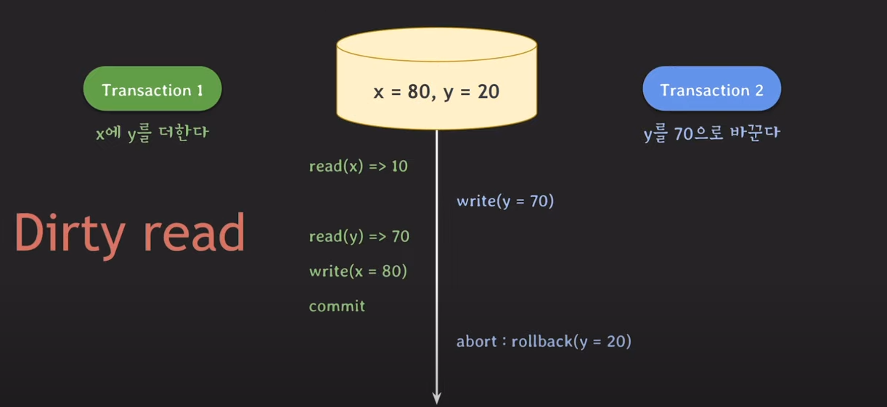
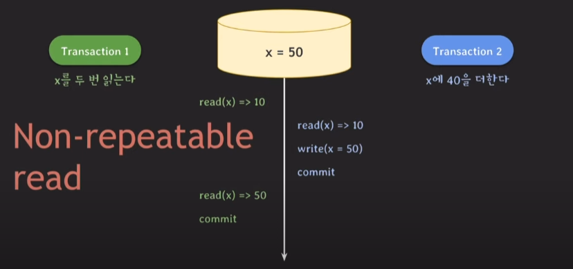
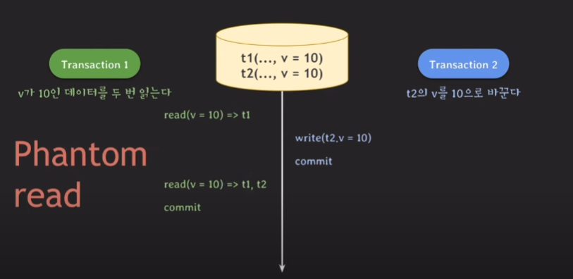
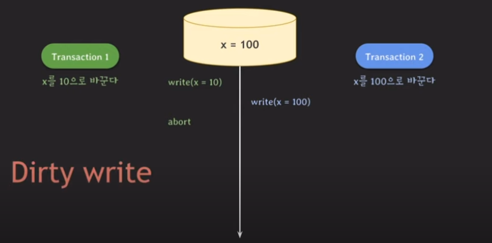
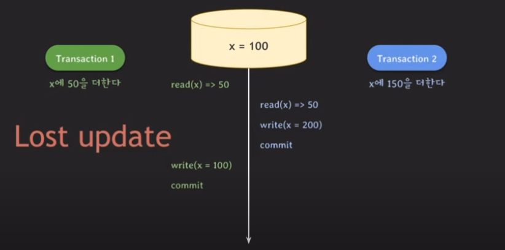
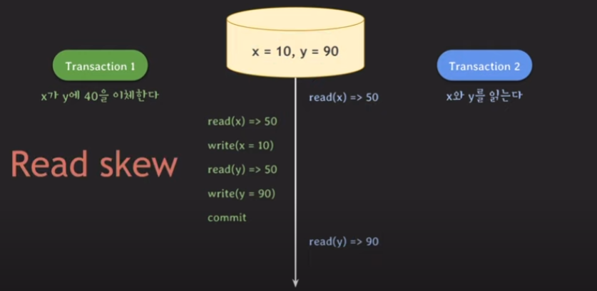
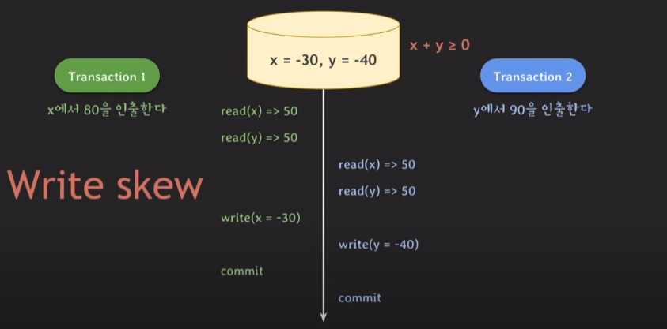
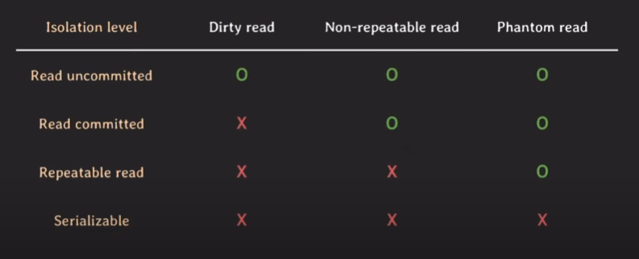

# isolation level

## isolation 의 정의

isolation(격리성)은 데이터베이스에서 여러 사용자가 동시에 데이터를 접근할 때, 각각의 사용자가 다른 사용자의 작업에 영향을 받지 않도록 하는 것, 즉, 하나의 트랜잭션이 다른 트랜잭션에 영향을 미치지 않고 독립적으로 실행될 수 있도록 보장하는 것

## isolation 이 안될 때 발생할 수 있는 여러 현상

### Dirty read (commit 되지 않은 변화를 읽음)

트랜잭션 1는 x에 y를 더한다. 그리고 트랜잭션 2는 y를 70으로 바꾼다. 라는 요구사항이 있을 때 

1. `트랜잭션 1`이 x의 값을 읽는다
2. `트랜잭션 2`이 y의 값을 70으로 변경한다
3. `트랜잭션 1`이 변경된 y의 값을 읽는다
4. `트랜잭션 1`이 x에 y를 더해 x의 값이 80으로 변경된다
5. `트랜잭션 1` 커밋
6. `트랜잭션 2`에 문제가 생겨 abort 을 한다

이 상황을 살펴보면 `트랜잭션 1`에 의해 바뀐 80이라는 값은 롤백된 `트랜잭션 2`이 변경한 y의 값을 읽었기 때문에 올바르지 않은 값이 되는 것이고 이런 현상을 `Dirty read` 라고 한다.

---

### Non-repeatable read (같은 데이터의 값이 달라짐)

트랜잭션 1은 x를 2번 읽는다. 그리고 트랜잭션 2는 x에 40을 더한다. 라는 요구사항이 있을 때 

1. `트랜잭션 1`이 x의 값을 읽는다
2. `트랜잭션 2`이 x의 값을 읽는다
3. `트랜잭션 2`이 x의 값을 변경한다
4. `트랜잭션 1`이 다시 한번 x의 값을 읽는다
5. `트랜잭션 1` 커밋

트랜잭션 1은 한 트랜잭션에서 x의 값을 2번 읽었음에도 불구하고 다른 값이 출력되었다. isolation 관점에서 보면 일어나면 안되는 현상이다. 트랜잭션의 isolation 속성이 의미하는 것은 여러 트랜잭션이 동시에 실행되어도 마치 하나의 트랜잭션이 동작하는 것처럼 실행되어야 하는데 isolation 관점에서 보면 이상 현상이다. 이런 현상을 `Non-repeatable read` 혹은 `Fuzzy read` 라고 부른다.

---

### Phantom read (없던 데이터가 생김)

트랜잭션 1은 v가 10인 데이터를 2번 읽는다. 트랜잭션 2는 t2의 v를 10으로 바꾼다. 라는 요구사항이 있을 때

1. `트랜잭션 1`이 t1의 v의 값을 읽는다
2. `트랜잭션 2`이 t2의 v의 값을 10으로 변경한다
 3. `트랜잭션 2` 커밋
4. `트랜잭션 1`이 t1,t2의 v의 값을 읽는다
5. `트랜잭션 1` 커밋

동일한 조건으로 하나의 트랜잭션안에서 두번을 읽었을 때 각각의 결과가 다르다면 isolation 관점에서 봤을 때 이상 현상이다. 이런 현상을 `Phantom read` 라고 부른다.

---

### Dirty write (commit 안된 데이터를 write 함)

트랜잭션 1은 x를 10으로 바꾼다. 트랜잭션 2는 x를 100으로 바꾼다. 라는 요구사항이 있을 때

1. x의 초기값은 0이다
2. `트랜잭션 1`이 x의 값을 10으로 바꾼다
3. `트랜잭션 2`이 x의 값을 100으로 바꾼다
4. `트랜잭션 2` 커밋
5. `트랜잭션 1`이 abort 한다

트랜잭션 1이 abort를 하게 되면 트랜잭션 2가 변경한 x의 값은 사라지게 된다. 만약 트랜잭션 2도 다음 단계에서 abort를 한다면 x를 100으로 변경하기 이전 x=10의 상태로 변경한다. 두개의 예시 모두 정상적인 동작은 아니다. 이처럼 두개의 트랜잭션이 하나의 값을 write 할 때 발생하는 이상 현상을 `Dirty write` 라고 부른다.

---

### Lost update (업데이트를 덮어 씀)

트랜잭션 1은 x에 50을 더한다. 트랜잭션 2는 x를 100으로 바꾼다. 라는 요구사항이 있을 때 

1. `트랜잭션 1`이 x의 값을 50으로 바꾼다
2. `트랜잭션 2`이 x의 값을 읽는다
3. `트랜잭션 2`이 x의 값을 200으로 변경한다
4. `트랜잭션 2` 커밋
5. `트랜잭션 1`이 x의 값을 100으로 바꾼다

만약 트랜잭션 1과 트랜잭션 2이 순차적으로 차례대로 실행됬더라면 최종적으로 x의 값은 250이 되었지만 겹쳐서 실행이 되었기 때문에 트랜잭션 2의 작업이 사라졌다. 이런 현상을 `Lost update` 라고 부른다. 

---

### Read skew (불일치한 데이터 읽기)

트랜잭션 1은 x가 y에 40을 이체한다. 트랜잭션 2는 x와 y를 읽는다. 라는 요구사항이 있을 때

1. `트랜잭션 2`이 x의 값을 읽는다
2. `트랜잭션 1`이 x의 값을 읽는다
3. `트랜잭션 1`이 x의 값을 10으로 변경한다
4. `트랜잭션 1`이 y의 값을 읽는다
5. `트랜잭션 1`이 y의 값을 90으로 바꾼다
6. `트랜잭션 1` 커밋
7. `트랜잭션 2` 가 y의 값을 읽는다

x와 y의 합은 100이 되어야 하는데, 트랜잭션 2을 보면 x와 y의 합이 140이 되어 데이터 불일치가 일어난 것을 알 수 있다 이런 현상을 `Read skew` 라고 부른다.

---

### Write skew (불일치한 데이터 쓰기)

트랜잭션 1은 x에서 80을 인출한다. 트랜잭션 2는 y에서 90을 인출한다. 데이터베이스에 `x + y >= 0 이다` 라는 제약조건이 있을 때

1. `트랜잭션 1`이 x의 값을 읽는다
2. `트랜잭션 1`이 y의 값을 읽는다
3. `트랜잭션 2`이 x의 값을 읽는다
4. `트랜잭션 2`이 y의 값을 읽는다
5. `트랜잭션 1`이 x에서 80을 인출한다
6. `트랜잭션 2`이 y에서 90을 인출한다
7. `트랜잭션 1` 커밋
8. `트랜잭션 2` 커밋

결과적으로 결과값 보면 x=-30, y=-40 은 제약조건을 위배한다. 만약 이렇게 둘 다 커밋이 되었다면 데이터 불일치가 일어나게 된다. 이런 현상을 `Write sekw` 라고 부른다.

---

### isolation level

이런 이상 현상들이 모두 발생하지 않게 만들 수 있지만 제약사항이 많아져서 동시 처리 가능한 트랜잭션 수가 줄어들어 결국 데이터베이스의 전체 처리량(throughput)이 하락하게 된다.

일부 이상한 현상은 허용하는 몇가지 level을 만들어서 사용하자 필요에 따라 적절하게 선택할 수 있도록 한것이 `isolation level` 이다.

이상 현상을 정의하고 어떤 현상을 허용하는지에 따라 각각 `isolation level`이 구분된다. 애플리케이션 설계 시 `isolation level`을 통해 전체 처리량과 데이터 일관성 차이에서 어느 정도 거래를 할 수 있다.

---

사진,내용 출처
- https://www.youtube.com/watch?v=bLLarZTrebU
- https://chat.openai.com/chat