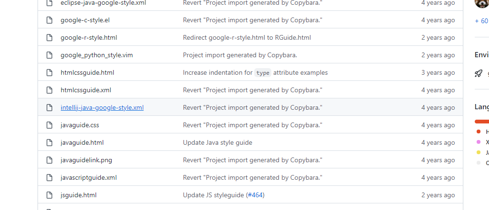
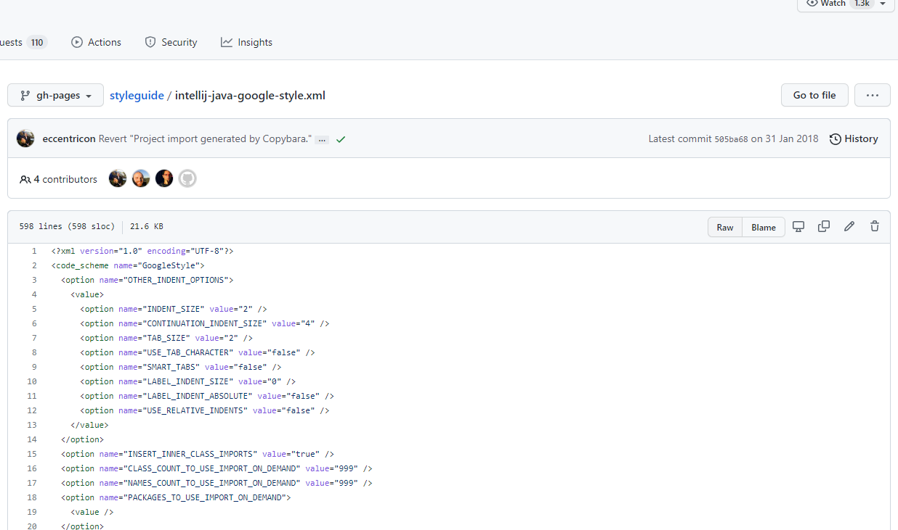
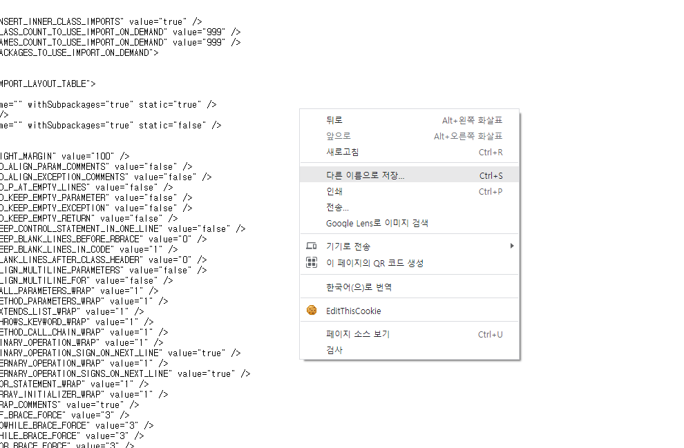
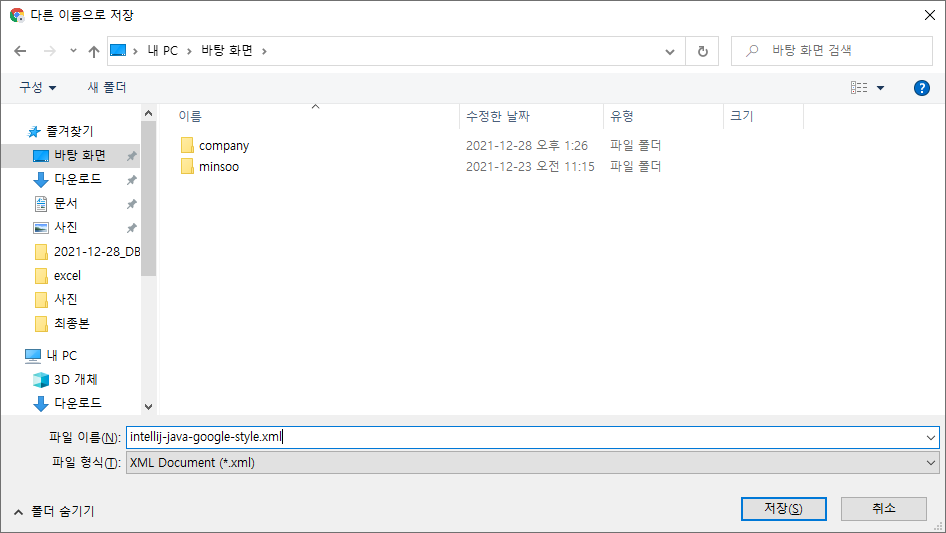
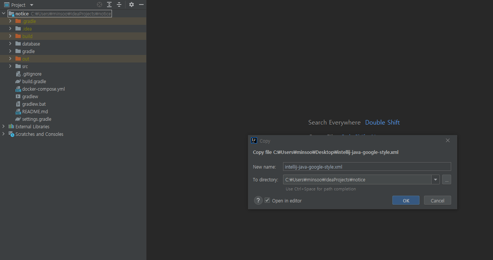
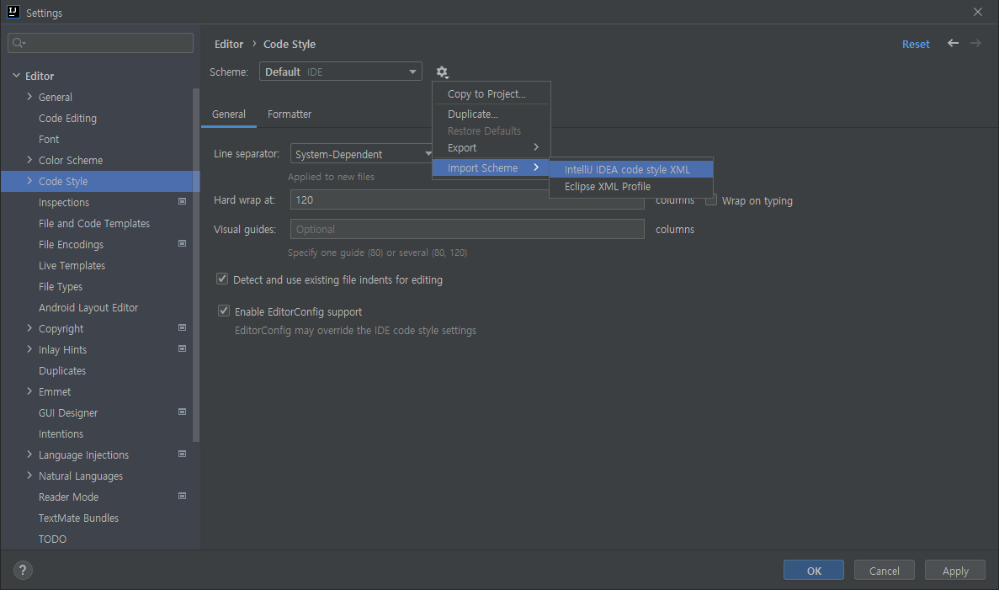
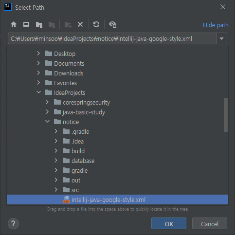
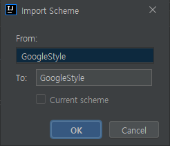
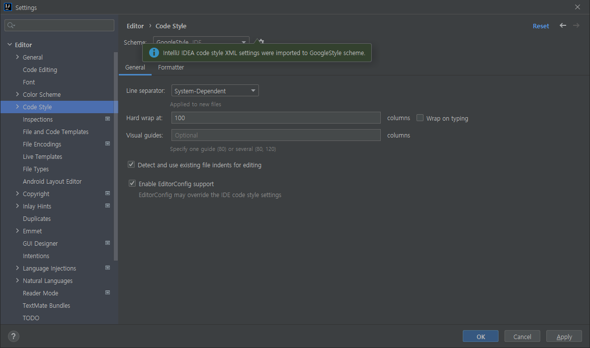

# intellij-java-google-style.xml 적용 방법

## intellij-java-google-style.xml 다운로드

---

해당 [링크](https://github.com/google/styleguide) 로 이동하여 `intellij-java-google.style.xml` 을 클릭합니다.

페이지 우측 중단에 `Raw` 를 클릭합니다.

페이지의 빈 공간에 마우스 우측을 클릭하여 저장하고 싶은 경로에 다른 이름으로 저장합니다.

`intellij-java-google-style.xml` 이 적용되어있지 않은 IDEA 에서도 언제든지 Git Repository 에서 Clone을 받으면 쉽게 적용할 수 있도록 프로젝트 내부로 이동해줍니다.

> 불특정 사용자, 환경에서도 Git Clone만 받으면 바로 로컬에서 개발 할 수 있도록 하는 것을 지향합니다.

## Intellij 설정

좌측 상단의 File > Setting > Editor > Code Style 탭으로 이동합니다.

톱니바퀴 버튼을 선택하고 Import Schema > Intellij IDEA code style XML 을 클릭합니다

이전에 저장한 경로에 있는 `intellij-java-google-style.xml` 을 선택합니다.

Scheme 이름을 변경하고 싶다면 To 영역에서 변경할 수 있습니다.

Import에 성공하면 `intellij-java-google-style.xml` 이 적용되었다는 초록색 문구가 뜨고 Apply → OK를 클릭하여 적용을 마무리하면 됩니다.

