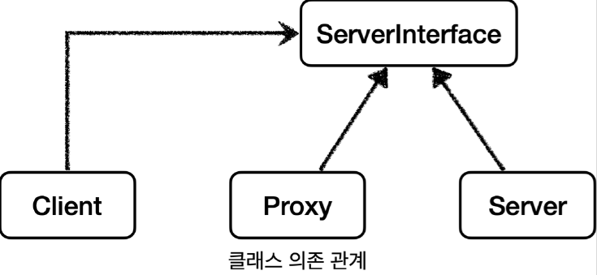
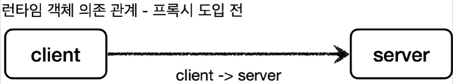
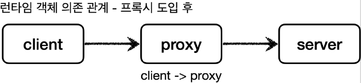
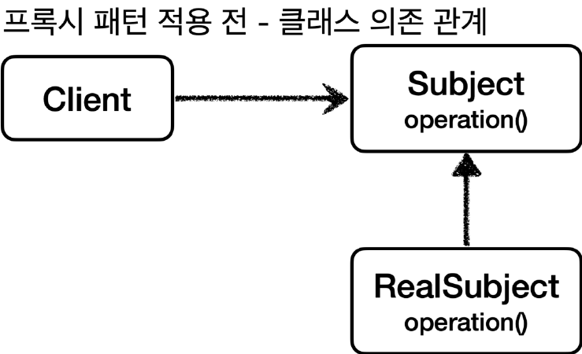
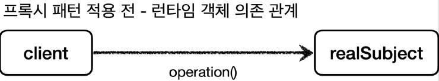
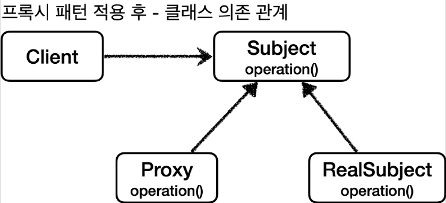
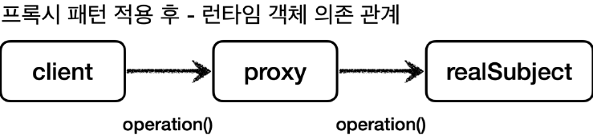

# 프록시 패턴

## 프록시

프록시는 대리(행위)나 대리권, 대리 투표, 대리인 등을 뜻하는 단어입니다. 이 개념을 클라이언트와 서버 개념에 도입한다면 클라이언트가 요청한 결과를 서버에 직접 요청하는 것이 아니라 어떤 대리자를 통해서 간접적으로
서버에 요청할 수 있습니다. 예를 들어서 내가 직접 마트에서 장을 볼 수도 있지만, 누군가에게 대신 장을 봐달라고 부탁할 수도 있습니다. 여기서 대신 장을 보는 대리자를 영어로 `Proxy` 라고 합니다.

## 프록시의 역할

### 대체 가능

객체에서 프록시가 되려면, 클라이언트는 서버에게 요청을 한 것인지, 프록시에게 요청을 한 것인지 조차 몰라야 합니다. 쉽게 이야기하면 서버와 프록시는 같은 인터페이스를 사용해야 합니다. 그리고 클라이언트가 사용하는
서비스 객체를 프록시 객체로 변경해도 클라이언트 코드를 변경하지 않고 동작할 수 있어야 합니다.


서버와 프록시가 같은 인터페이스 사용

클래스 의존관계를 보면 클라이언트는 서버 인터페이스(ServerInterface)에만 의존합니다. 그리고 서버와 프록시가 같은 인터페이스를 사용합니다. 따라서 DI를 사용해서 대체가 가능합니다.





이번에는 런타임 객체 의존 관계를 살펴보겠습니다. 런타임(애플리케이션 실행 시점)에 클라이언트 객체에 DI를 사용해서 `Client->Server` 에서 `Client->Proxy` 로 객체 의존관계를 변경해도
클라이언트 코드를 전혀 변경하지 않아도 됩니다. 클라이언트 입장에서는 변경 사실 조차 모르게 됩니다. DI를 사용하면 클라이언트 코드의 변경 없이 유연하게 프록시를 주입할 수 있습니다.

## 프록시의 주요 기능

프록시를 통해서 할 수 있는 일은 크게 2가지로 구분할 수 있습니다.

- 접근제어
    - 권한에 따른 접근 차단
    - 캐싱
    - 지연 로딩
- 부가 기능 추가
    - 원래 서버가 제공하는 기능에 더해서 부가 기능을 수행
        - 예) 요청 값이나, 응답 값을 중간에 변형한다
        - 예) 실행 시간을 측정해서 추가 로그를 남긴다

프록시 객체가 중간에 있으면 크게 `접근 제어` 와 `부가 기능 추가` 를 수행할 수 있습니다.

### GOF 디자인 패턴

둘다 프록시를 사용하는 방법이지만 GOF 디자인 패턴에서는 이 둘을 의도(intent)에 따라서 프록시 패턴과 데코레이터 패턴으로 구분합니다.

- 프록시 패턴: 접근 제어가 목적
- 데코레이터 패턴: 새로운 기능 추가가 목적

둘다 프록시를 사용하지만, 의도가 다르다는 점이 핵심입니다. 용어가 프록시 패턴이라고 해서 이 패턴만 프록시를 사용하는 것이 아니라 데코레이터 패턴도 프록시를 사용합니다

> 참고: 프록시라는 개념은 클라이언트 서버라는 큰 개념안에서 자연스럽게 발생할 수 있습니다.
> 프록시는 객체안에서의 개념도 있고, 웹 서버에서의 프록시도 있습니다.
> 객체 안에서 객체로 구현되어 있는가, 웹 서버로 구현되어 있는가 처럼 규모의 차이가 있을 뿐 근본적인 역할은 같습니다.

## 프록시 패턴 적용 전





```
public interface Subject {
  String doAction();
}
```

```
public class RealSubject implements Subject {

  @Override
  public String doAction() {
    System.out.println("실제 객체 실행");
    sleep(1000);
    return "test";
  }

  private void sleep(int millis) {
    try {
      Thread.sleep(millis);
    } catch (InterruptedException e) {
      e.printStackTrace();
    }
  }
}
```

```
public class Client {

  Subject subject;

  public Client(Subject subject) {
    this.subject = subject;
  }

  public void execute() {
    subject.doAction();
  }
}
```

`Subject` 인터페이스에 의존하고, `Subject` 를 호출하는 클라이언트 코드입니다.
`execute()` 를 실행하면 `subject.operation()` 를 호출합니다.

```
  @Test
  void test() {
    RealSubject realSubject = new RealSubject();
    Proxy proxy = new Proxy(realSubject);
    Client client = new Client(proxy);
    client.execute();
    client.execute();
    client.execute();
  }
```

테스트 코드에서는 `client.execute()` 를 3번 호출합니다. 데이터를 조회하는데 1초가 소모되므로 총 3초의 시간이 발생합니다. 그런데 이 데이터가 한번 조회하면 변하지 않는 데이터라고 했을 때, 어딘가
보관해두고 이미 조회한 데이터를 사용하는 것이 성능상 좋습니다. 이런 것을 캐시라고 합니다. 프록시 패턴의 주요 기능은 접근 제어입니다. 캐시도 접근 자체를 제어하는 기능 중 하나입니다.

## 프록시 패턴 적용 후

이번에는 이미 개발된 로직을 전혀 수정하지 않고, 프록시 객체를 통해 캐시를 적용해보겠습니다.





```
public class Proxy implements Subject {

  private Subject subject;
  private String value;

  public Proxy(Subject subject) {
    this.subject = subject;
  }

  @Override
  public String doAction() {

    System.out.println("프록시 실행");

    if (value == null) {
      value = subject.doAction();
    }

    return value;
  }
}
```

앞서 설명한 것처럼 프록시도 실제 객체와 모양이 같아야 하기 때문에 `Subject` 인터페이스를 구현해야 합니다.

> 클라이언트가 프록시를 호출하면 프록시가 최종적으로 실제 객체를 호출해야 하기 때문에 내부에 실제 객체의 참조를 가지고 있어야 합니다.

```
  @Test
  void test() {
    RealSubject realSubject = new RealSubject();
    Proxy proxy = new Proxy(realSubject);
    Client client = new Client(proxy);
    client.execute();
    client.execute();
    client.execute();
  }
```

`realSubject` 와 `proxy` 를 생성하고 둘을 연결합니다. 결과적으로 `proxy` 가 `realSubject` 를 참조하는 런타임 객체 의존관계가 완성됩니다. 그리고 마지막으로 `client`
에 `realSubject` 가 아닌 `proxy` 를 주입합니다. 이 과정을 통해서 `client -> proxy -> realSubject` 런타임 객체 의존관계가 완성됩니다.

결과적으로 프록시를 도입하기 전에는 3초가 걸렸지만, 프록시 도입 이후에는 최초에 한번만 1초가 걸리고, 이후에는 거의 즉시 반환됩니다.

## 정리

프록시 패턴의 핵심은 `RealSubject` 코드와 `Client` 코드를 전혀 변경하지 않고, 프록시를 도입해서 접근 제어를 했다는 점 입니다. 그리고 `Client` 코드의 변경 없이 자유롭게 프록시를 넣고 뺄
수 있습니다. 실제 `Client` 입장에서는 프록시 객체가 주입되었는지, 실제 객체가 주입되었는지 알지 못합니다.