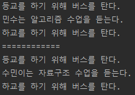
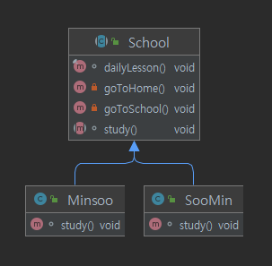

# 템플릿_메소드_패턴

토비의 스프링에서는 템플릿 메소드 패턴을 다음과 같이 정의합니다.

> 상속을 통해 슈퍼 클래스의 기능을 확장할 때 사용하는 가장 대표적인 방법. 변하지 않는 기능은 슈퍼 클래스에 만들어두고 자주 변경되며 확장할 기능은 서브 클래스에서 만들도록 한다.

## 템플릿 메소드 패턴 예제

템플릿 메소드 패턴를 쉽게 이해하기 위하여 간단한 예제로 살펴보겠습니다.

```
민수와 수민이는 등교와 하교를 같이 하는 대학교 동기입니다.
민수는 알고리즘 수업을 듣고 수민이는 자료구조 수업을 듣습니다.
```

민수와 수민이의 하루 학교 일과를 나누어 보겠습니다.

- 민수
    - 등교
    - 알고리즘 수업
    - 하교

- 수민
    - 등교
    - 자료구조 수업
    - 하교

### 템플릿 메소드 패턴 적용 전

이제 민수와 수민이의 하루 학교 일과를 코딩해보겠습니다.

```
public class Minsoo {

    public void dailyLesson() {
        goToSchool();
        study();
        goToHome();
    }

    private void goToSchool() {
        System.out.println("등교버스를 탄다.");
    }

    private void study() {
        System.out.println("민수는 알고리즘 수업을 듣는다.");
    }

    private void goToHome() {
        System.out.println("하교버스를 탄다.");
    }
}
```

```
public class Soomin {

    public void dailyLesson() {
        goToSchool();
        study();
        goToHome();
    }

    private void goToSchool() {
        System.out.println("등교버스를 탄다.");
    }

    private void study() {
        System.out.println("수민이는 자료구조 수업을 듣는다.");
    }

    private void goToHome() {
        System.out.println("하교버스를 탄다.");
    }
}
```

```
public class TemplateMethodBeforeTest {

    @Test
    void test() {
        Minsoo minsoo = new Minsoo();
        Soomin soomin = new Soomin();

        minsoo.dailyLesson();
        System.out.println("============");
        soomin.dailyLesson();
    }
}
```



예쁘게 잘 구현한것 같지만 `Minsoo` 클래스와 `Soomin` 다시 살펴보면 중복이 존재합니다.

> 만약 학생 클래스가 수백개라면???

## 템플릿 메소드 적용 후

`중복된 메소드를 추상 클래스를 사용하면 중복을 줄일 수 있지 않을까?`

알고리즘의 구조를 그대로 유지하면서 공통되는 부분을 추상화해보겠습니다.

```
public abstract class School {

    final void dailyLesson() {
        goToSchool();
        study();
        goToHome();
    }

    private void goToSchool() {
        System.out.println("등교버스를 탄다.");
    }

    private void goToHome() {
        System.out.println("하교버스를 탄다.");
    }

    abstract void study();
}
```

`School` 이라는 추상 클래스를 만들어 공통되는 부분인 `goToSchool` `goToHome` 를 구현하였고, `dailyLesson` 메소드에 추가해주었습니다. 학생들마다 듣는 수업이 각자 다를 수
있으니 `study` 라는 메소드는 `School` 클래스를 상속받은 각 학생 클래스에서 구현합니다.

```
public class Minsoo extends School {
    @Override
    void study() {
        System.out.println("민수는 알고리즘 수업을 듣는다.");
    }
}
```

```
public class SooMin extends School {
    @Override
    void study() {
        System.out.println("수민이는 자료구조 수업을 듣는다.");
    }
}
```

```
public class TemplateMethodAfterTest {

    @Test
    void test(){
        Minsoo minsoo = new Minsoo();
        SooMin sooMin = new SooMin();

        minsoo.dailyLesson();
        System.out.println("============");
        sooMin.dailyLesson();
    }
}
```

템플릿 메소드 패턴 적용 예시를 클래스 다이어그램으로 표현하면 다음과 같습니다.



## 결론

결과적으로 템플릿 메소드 패턴은 동일한 과정을 수행하는 `변하지 않는 것` 과 확장할 기능인 `변하는 것` 을 분리하여 상위 클래스에 정의를 하고, 상위 클래스가 하위 클래스를 호출하는 것이 특징인 디자인 패턴입니다.