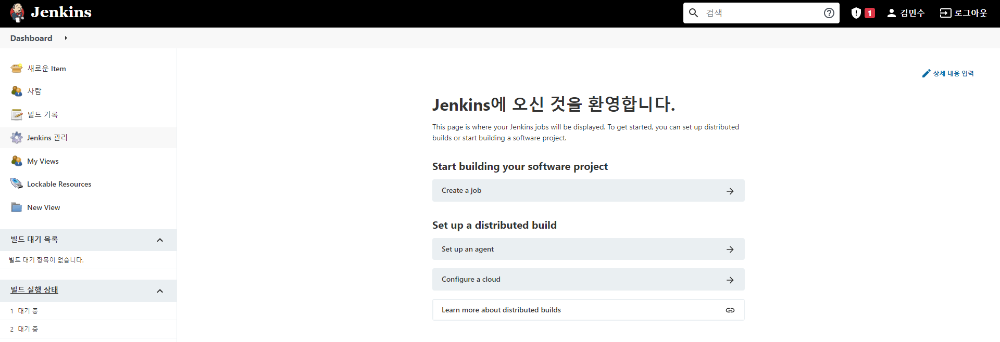

# Jenkins를 이용한 배포 자동화(1) - Docker로 Jenkins 설치 방법

기존 사내에서는 `PuTTY` 와 `FileZilla`를 사용하여 수동 배포를 진행하고 있습니다. 요구사항의 변경과 충분한 테스트 검증이 되지 않은 기능이 반영되어 사이드 이펙트를 발생하는 일이 잦았고, 최근 테스트
서버까지 추가되면서 배포의 비용(시간)이 많이 소모되었습니다. 여러가지 CI 도구들이 있지만 무료 및 오픈소스이면서, 레퍼런스가 많은 `Jenkins` 를 채택하였습니다.

***이 포스팅은 `Jenkins` 를 구축 환경에 `Docker`가 설치되어 있다는 가정하에 작성되었습니다.***

## 구축 환경

- Spring Boot
- Gradle
- Github
- Docker

> 로컬 환경에서 Jenkins를 구축하실 경우 로컬 네트워크 터널을 열기 위한 ngrok이 필요합니다

## 1. Docker Hub를 통한 Jenkins Image 다운로드

```
docker pull jenkins/jenkins:lts
```

설치가 완료되었다면 `docker images` 명령어를 통해 이미지를 확인합니다.

## 2. jenkins Image를 Container로 실행하기

```
docker run -v ./jenkins_home:/var/jenkins_home --name jenkins -e TZ=Asia/Seoul -p 9999:8080 -p 10000:50000 jenkins/jenkins:lts -d
```

터미널에 위의 명령어를 기입하여 컨테이너를 실행합니다. Volume, Port 옵션은 호스트 환경에 맞게 수정하면 됩니다. 컨테이너 실행이 완료되었다면 `docker ps` 명령어를 통해 컨테이너를 확인합니다.

#### 주요 옵션 설명

- -v : 호스트 디렉토리와 컨테이너 디렉토리를 공유한다는 뜻
    - 컨테이너를 삭제하면 저장되어 있던 정보가 사라지기 때문에 볼륨을 사용하여 영속화 시킬수 있다
- -e : 컨테이너 내에서 사용할 환경변수 설정
    - TimeZone 설정없이 컨테이너를 실행하면 시간이 동기화 되어있지 빌드 시간 표기가 제대로 되지 않는다
- -p :    호스트와 컨테이너의 포트를 연결
    - 8080은 젠킨스 웹 서버 포트, 50000은 jnlp로 원격 빌드시 사용하는 포트
- -d : 백그라운드 모드

## 3. Jenkins 접속 및 초기 관리자 비밀번호 확인

```
호스트 IP:9999
```

호스트 IP와 설정한 포트를 입력하여 Jenkins 에 접속합니다.


초기 관리자 비밀번호를 입력하라는 화면이 나오면 다시 터미널로 이동하여 아래의 명령어를 입력합니다.

```
docker exec jenkins cat /var/jenkins_home/secrets/initialAdminPassword
```

터미널에 출력되는 문자열을 복사하고 화면에 비밀번호를 기입합니다.

## 4. 기본 플러그인 설치 및 젠킨스 기본 설정

Install suggested plugins 클릭하여 기본 플러그인을 설치합니다.


기본 플러그인이 설치가 완료되었다면 젠킨스 계정을 설정합니다.


Jenkins URL을 설정한다 특별히 변경이 필요없다면 Save and Finish 버튼을 클릭합니다.


Start using Jenkins 버튼을 클릭하면 Jenkins 메인화면이 나옵니다.




배포 자동화를 위한 Docker를 이용한 Jenkins 설치가 모두 끝났습니다.

Github Webhook 을 이용한 Jenkins 와 Github 연동은 다음 포스팅에 이어서 진행하겠습니다.