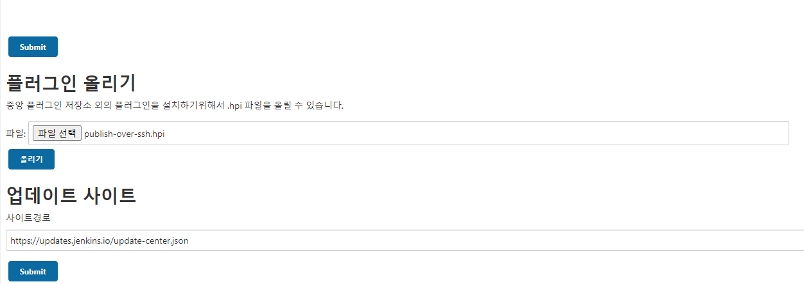

# Jenkins를 이용한 배포 자동화(3) - Publish Over SSH 를 이용한 원격 서버 배포

> Publish over SSH 플러그인이 2022년 1월 12일 부로 젠킨스 보안 정책으로 인해 배포가 중단되었습니다.
>
> https://www.jenkins.io/security/advisory/2022-01-12/

Publish Over SSH plugin 을 사용하면 원격 서버에 SSH를 통한 배포를 할 수 있습니다.

## SSH란?

SSH란 `Secure Shell Protocol` 의 약자로 네트워크 상의 다른 컴퓨터에 로그인 하거나 원격 시스템에서 명령을 실행하고 다른 시스템으로 파일을 복사할 수 있도록 해주는 응용 프로그램 또는 그
프로토콜은 가리킵니다.

## 1. Publish Over SSH 설치

현재 젠킨스 플러그인 관리를 통한 설치가 불가능 하기 때문에 직접 `.hpi` 확장자를 다운로드 하여 설치해야 합니다.

https://archives.jenkins-ci.org/plugins/publish-over-ssh/latest/ 에 접속하여 `publish-over-ssh.hpi` 파일을 다운로드 합니다.

`Jenkins 관리` -> `플러그인 관리` -> `고급` -> `플러그인 올리기` 으로 이동하여 다운로드 파일을 첨부 후 `올리기` 버튼을 클릭하면 설치를 수동으로 진행할 수 있습니다.



## 2. Publish Over SSH 설정

Docker 컨테이너 내부로 접근합니다

```
docker exec -it jenkins /bin/bash
```

```
ssh-keygen -t rsa -C "jenkins" -m PEM -P "" -f /home/jenkins/.ssh/id_rsa
```