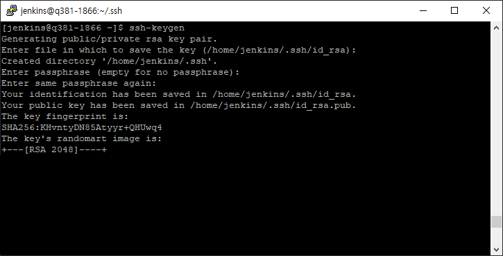
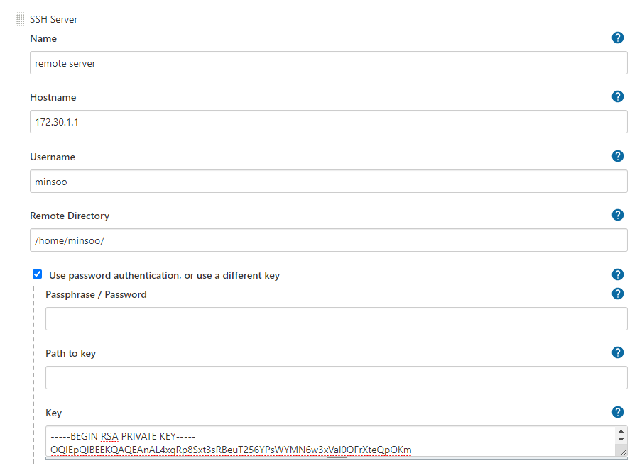
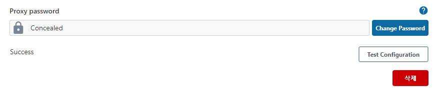

# Jenkins를 이용한 배포 자동화(3) - Publish Over SSH 를 이용한 원격 서버 배포

> Publish over SSH 플러그인이 2022년 1월 12일 부로 젠킨스 보안 정책으로 인해 배포가 중단되었습니다.
>
> https://www.jenkins.io/security/advisory/2022-01-12/

Publish Over SSH plugin 을 사용하면 원격 서버에 SSH를 통한 배포를 할 수 있습니다.

## SSH란?

SSH란 `Secure Shell Protocol` 의 약자로 네트워크 상의 다른 컴퓨터에 로그인 하거나 원격 시스템에서 명령을 실행하고 다른 시스템으로 파일을 복사할 수 있도록 해주는 응용 프로그램 또는 그
프로토콜은 가리킵니다.

## 1. Publish Over SSH 설치

현재 젠킨스 플러그인 관리를 통한 설치가 불가능 하기 때문에 직접 `.hpi` 확장자를 다운로드 하여 설치해야 합니다.

https://archives.jenkins-ci.org/plugins/publish-over-ssh/latest/ 에 접속하여 `publish-over-ssh.hpi` 파일을 다운로드 합니다.

`Jenkins 관리` -> `플러그인 관리` -> `고급` -> `플러그인 올리기` 으로 이동하여 다운로드 파일을 첨부 후 `올리기` 버튼을 클릭하면 설치를 수동으로 진행할 수 있습니다.


## 2. Jenkins 서버에서 SSH key 발급

젠킨스가 설치되어 있는 서버에서 `jenkins` 계정으로 로그인 한 뒤 아래의 명령어를 입력합니다. (passphrase는 따로 설정을 하지 않을 것이기 때문에 Enter를 입력하시면 됩니다)

```
ssh-keygen
```



생성이 완료 되었다면 /home/jenkins/.ssh 경로에 `id_rsa`, `id_rsa.pub` 파일이 2개 생성됩니다.

- id_rsa: private key
    - 절대로 타인에게 노출이 되면 안된다
- id_rsa.pub: public key
    - 접속하려는 원격 서버의 authorized_key에 입력한다

## 3. Publish Over SSH 설정

`Jenkins 관리` -> `시스템 설정` -> `Publish Over SSH` 탭에서 추가 버튼을 클릭하고 아래의 정보를 입력합니다.

- Name: SSH Server 를 구분할 수 있는 이름
- HostName: SSH를 이용해 파일을 전송하려는 원격 서버
- Username: 원격 서버 계정명
- Remote Directory: 원격 서버 디렉토리 입력

고급 탭으로 이동하여 `Use password authentication, or use a different key` 에 체크한 뒤 Jenkins 서버에서 생성한 id_rsa 내용을 아래의 명령어를 통해 복사하여
입력합니다.

```
cat /home/jenkins/.ssh/id_rsa
```



## 4. 원격 서버 설정

비밀번호 대신 원격 서버에 접속하려면 .ssh 디렉토리에 authorized_key 파일이 필요합니다. 원격 서버에서 아래의 명령어를 입력하여 파일을 생성합니다.

.ssh 디렉토리가 없는 경우

```
mkdir ~/.ssh
```

```
vi ~/.ssh/authorized_key
```

`authorized_key` 파일에 젠킨스 서버에서 발급받은 `id_rsa.pub` 내용을 복사하여 입력합니다.

```
cat /home/jenkins/.ssh/id_rsa.pub
```

.ssh 디렉토리는 중요한 정보가 담긴 디렉토리이기 때문에. Permission 권한을 수정해주어야 한다(권한이 맞지 않으면 SSH 인증이 동작하지 않습니다)

```
chmod 700 ~/.ssh
chmod 644 ~/.ssh/authorized_keys
```

원격 서버까지 설정이 모두 끝났다면 다시 Jenkins로 이동하여 `Test Configuration` 을 클릭하여 정상적으로 인증에 성공하는지 테스트 합니다.



## 5. Jenkins Item 설정

이전 포스팅에서 만들었던 Item의 구성으로 이동하여 

