# jenkins를 이요한 배포 자동화(4) - Jenkins & Slack 연동 방법

`Jenkins` 를 이용하여 배포 자동화를 구축하였지만 매번 `Build` 에 성공하였는지 매번 상태를 확인해야하는 번거로움이 있습니다.

이번 포스팅에서는 `Jenkins` 와 `Slack` 을 연동하여 알람을 받는 방법을 구축해보겠습니다.

## Slack 채널 생성

`Jenkins` 의 `Build` 상태를 알림받을 채널을 추가합니다. 글쓴이는 jenkins 라는 채널을 추가하였습니다.

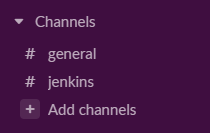

## Jenkins CI App 설치

`Slack` 하단의 `Apps` -> `Add apps` 탭에서 `Jenkins CI` 를 검색하고 `Add` 를 클릭합니다.


`Add to Slack` 을 클릭합니다.

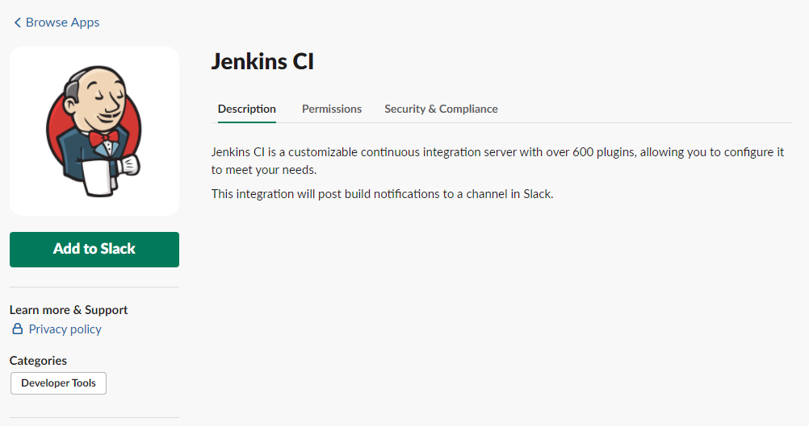

`Jenkins` 의 알림을 수신받을 채널을 선택합니다.

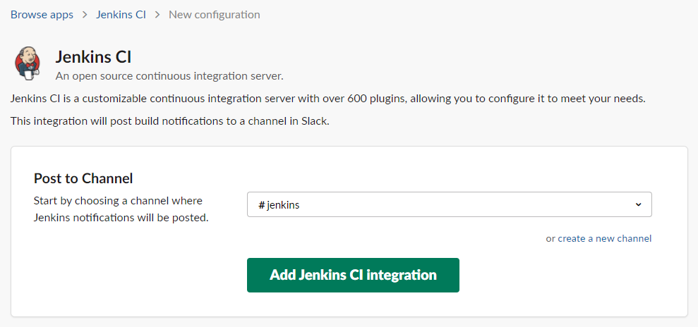

`Step3` 으로 이동하여 `Team Subdomain` 와 `Integration Token Credential ID` 를 복사합니다.

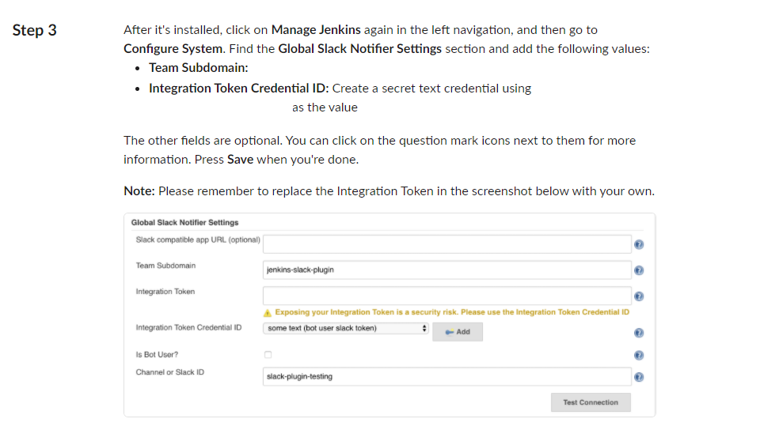

기타 추가 설정을 마무리 되었다면 `Save Setting` 버튼을 클릭하고 다시 `Jenkins CI` -> `Configuration` 으로 이동하여 설정이 저장되었는지 확인합니다.

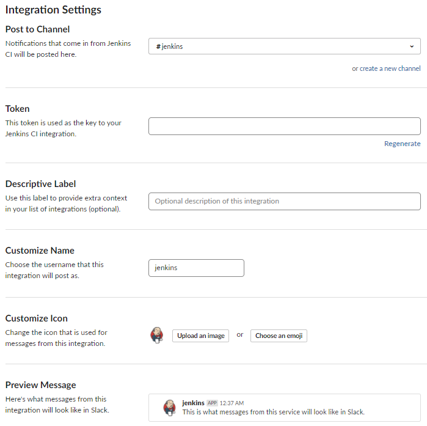

## Jenkins Plugin 설치

`Jenkins 관리` -> `플러그인 관리` -> `설치 가능` 탭으로 이동하여 `Slack Notification` 을 검색하고 설치합니다.

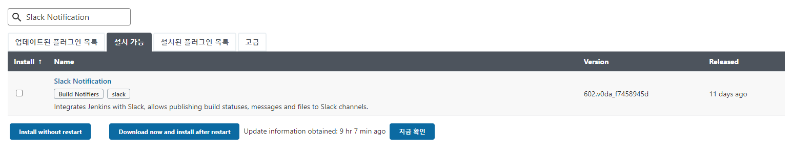

플러그인 적용을 위해 `설치가 끝나고 실행중인 작업이 없으면 Jenkins 재시작.` 항목에 체크를 하고 Jenkins를 재시작합니다. 만약 설치가 완료되어도 반응이 없거나, 체크박스에 클릭을 미처하지 못했다면
아래의 URL로 이동하여 Jenkins를 재시작 할 수 있습니다.

```
호스트 IP:9999/restart
```

## Slack Notification Plugin 설정

설치가 완료되었다면 `Jenkins 관리` -> `시스템 관리` -> `Slack` 탭으로 이동합니다.

- WorkSpace: 위에서 복사한 `Team Subdomain` 입력
- Default channel / member id: `Jenkins` 알림을 수신받기위해 생성한 채널명 입력

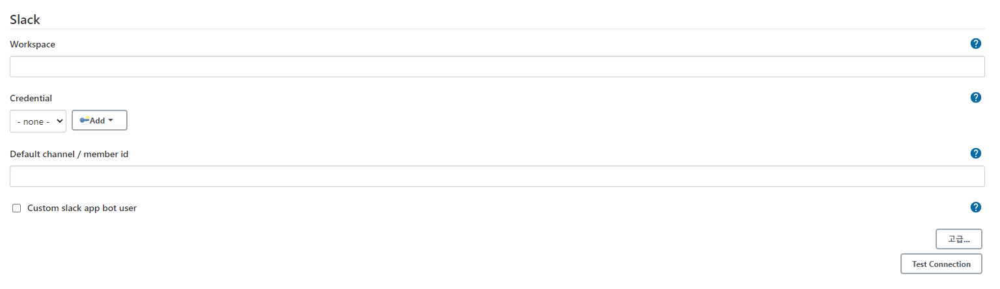

`Credential` -> `Add` 를 클릭하고 아래의 내용을 입력하고 `Add` 버튼을 클릭합니다.

- Kind: Secret text 선택
- Secret: 위에서 복사한 `Integration Token Credential ID` 입력
- ID: 구분할 수 있는 이름 입력

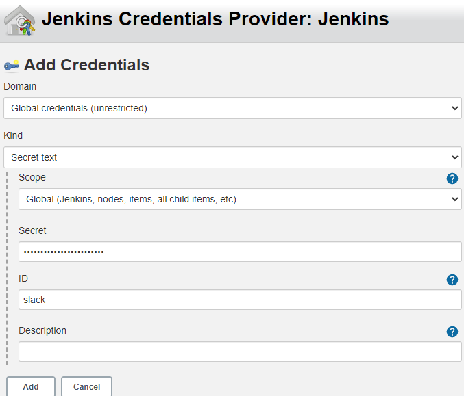

작성을 완료하였다면 `Test Connection` 버튼을 클릭하여 `Jenkins` 와 `Slack` 에서 테스트에 성공 여부를 확인합니다.

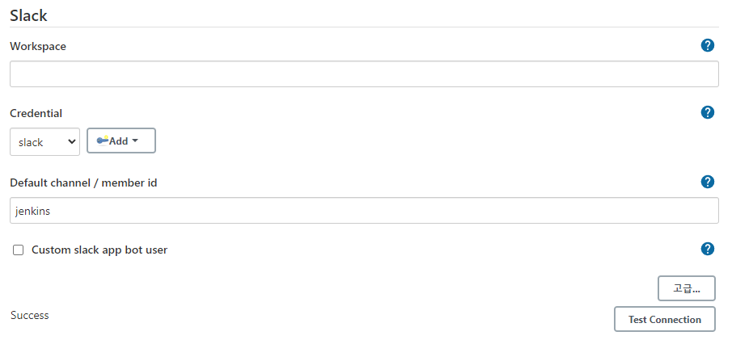


## Jenkins Item Slack 알림 연동

`Slack` 에게 알림을 보낼 `Jenkins Item` 의 `구성` 탭으로 이동합니다.

`빌드 후 조치 추가` -> `Slack Notification` 을 선택합니다.

알림받을 항목을 선택하고 `저장` 을 변경내용을 저장합니다.

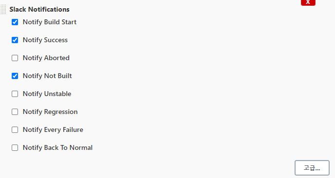

설정이 완료되었다면 `Build` 를 유발하여 정상적으로 `Slack` 이 `Jenkins` 의 알림을 수신받는지 확인합니다.

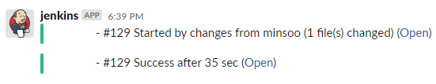

이상으로 지금까지 `Docker` 를 이용하여 `Jenkins` 배포 자동화 구축이 모두 마무리 되었습니다. 