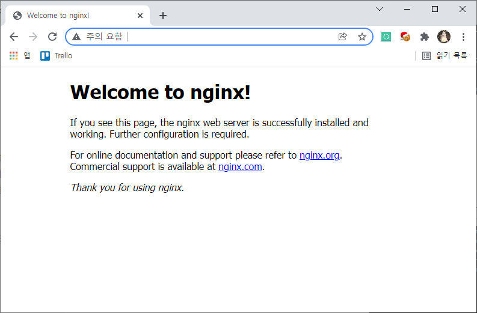

# CentOS 7 Nginx 설치 방법
### 1. Nginx YUM repository 추가
#### YUM Repository에 nginx 패키지가 존재하지 않기 때문에 수동으로 추가해준다.
```
sudo vi /etc/yum.repos.d/nginx.repo
```
```
[nginx]
name=nginx repo
baseurl=https://nginx.org/packages/centos/7/$basearch/
gpgcheck=0
enabled=1
```
#### name : 저장소의 이름
#### baseurl : 패키지 저장소의 url
#### gpgcheck : 패키지의 GPG 서명여부(1-사용,0-미사용), '1'로 설정할 경우 반드시 gpgkey 항목을 설정해야한다
#### enabled : 저장소 설정여부 (1-사용,0-미사용)

### 2. Nginx 설치
```
sudo yum install -y nginx
```
#### -y는 "예"를 의미하며 설치과정에서 모든 물음 여부에 Yes를 사용하겠다는 옵션이다.

### 3. 서비스 시작
```
sudo systemctl enable nginx
sudo systemctl start nginx
```
#### nginx 서비스를 활성화하고 시작한다.

### 4. nginx 접속 확인

#### 서버 IP&도메인 입력 후 정상적으로 nginx가 설치되었는지 확인한다. 


