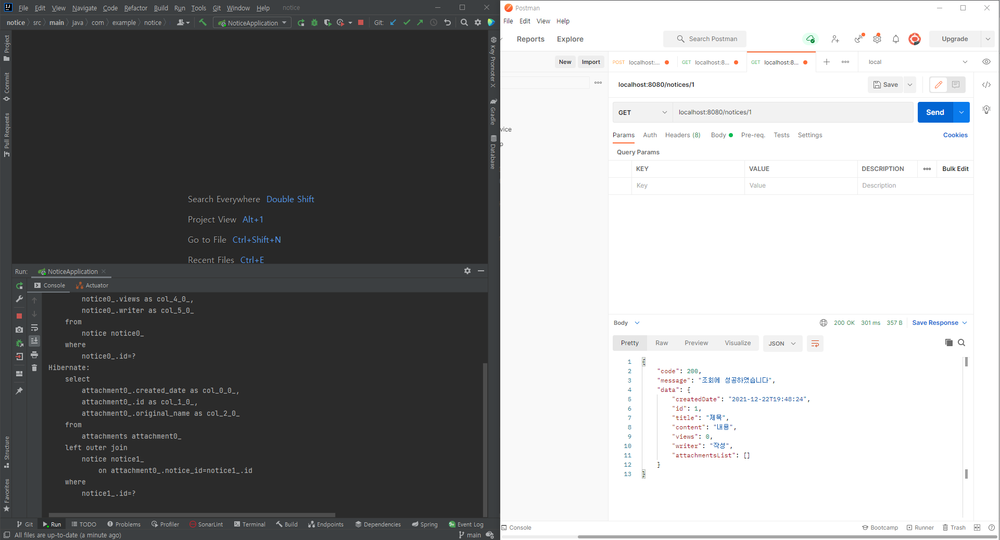
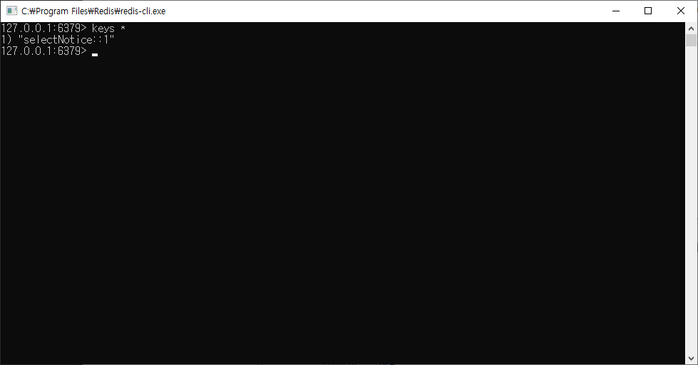
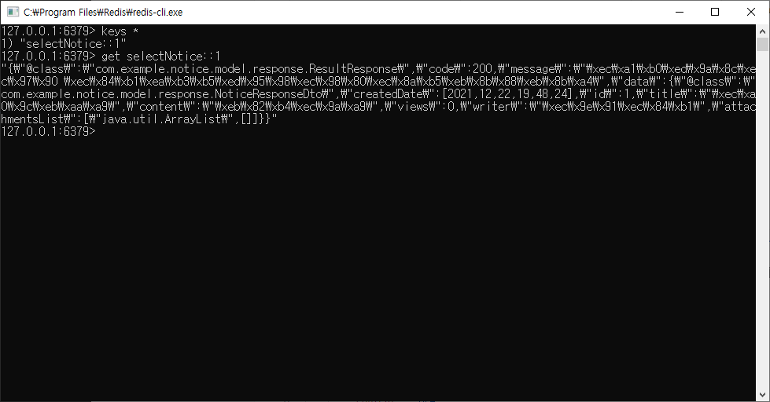
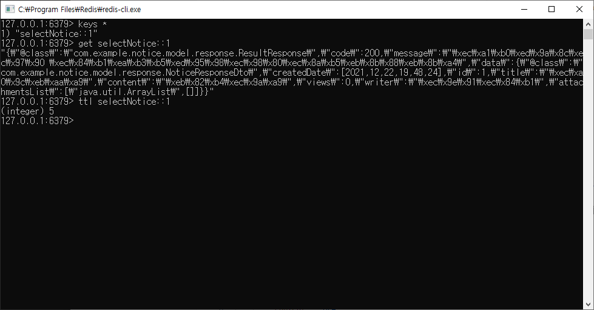

# Spring Boot Redis 연동 및 Cache 예제

### Redis 소개

`Redis`는 데이터베이스, 캐시 또는 메시지 브로커로 사용할 수 있는 오픈소스 인메모리 키-값 형태의 비 관계형 데이터베이스 입니다.

### Redis 설치

---
`Redis`의 설치는 [링크](https://github.com/microsoftarchive/redis/releases/tag/win-3.2.100) 에서 가능합니다

### 의존성 추가

---

#### Maven

```
<dependency>
    <groupId>org.springframework.boot</groupId>
    <artifactId>spring-boot-starter-data-redis</artifactId>
    <version>2.3.3.RELEASE</version>
</dependency>
```

#### Gradle

```
implementation 'org.springframework.boot:spring-boot-starter-data-redis'
```

### 사용자 설정 파일 수정

---

`application.yml`에 redis 기본 설정을 합니다.

```
spring:
  redis:
    host: 127.0.0.1
    port: 6379
```

### Redis 구성

---

애플리케이션 클라이언트와 `Redis` 서버 인스턴스 간의 연결 설정을 정의하려면 `Redis` 클라이언트를 사용해야합니다. Java에 사용할 수 있는 Redis 클라이언트는
`Jedis`와 `Lettuce`가 있지만 `Jedis`의 단점과 `Lettuce`의 장점 때문에 `Lettuce`로 추세가 넘어가고 있습니다.

### MainApplication 설정

`@EnableCaching` 설정을 추가하여 캐시 기능을 활성화 한다.

```
@EnableCaching
@EnableJpaAuditing
@SpringBootApplication
public class NoticeApplication {

  public static void main(String[] args) {
    SpringApplication.run(NoticeApplication.class, args);
  }

}
```

### Redis Configuration 설정

--- 

```
@Configuration
public class RedisConfig {

  @Value("${spring.redis.port}")
  public int port;

  @Value("${spring.redis.host}")
  public String host;


  @Bean
  public RedisTemplate<String, Object> redisTemplate(RedisConnectionFactory redisConnectionFactory) {
    RedisTemplate<String, Object> redisTemplate = new RedisTemplate<>();
    redisTemplate.setKeySerializer(new StringRedisSerializer());
    redisTemplate.setValueSerializer(new GenericJackson2JsonRedisSerializer());
    redisTemplate.setConnectionFactory(redisConnectionFactory);
    return redisTemplate;
  }

  @Bean
  public RedisConnectionFactory redisConnectionFactory() {
    RedisStandaloneConfiguration redisStandaloneConfiguration = new RedisStandaloneConfiguration();
    redisStandaloneConfiguration.setHostName(host);
    redisStandaloneConfiguration.setPort(port);
    return new LettuceConnectionFactory(redisStandaloneConfiguration);
  }
}

```

### Cache Configuration 설정

--- 

```
@Configuration
@RequiredArgsConstructor
public class CacheConfig {

  private final RedisConnectionFactory connectionFactory;

  @Bean
  public CacheManager cacheManager() {
    RedisCacheConfiguration redisConfiguration = RedisCacheConfiguration.defaultCacheConfig()
        .serializeKeysWith(RedisSerializationContext.SerializationPair.fromSerializer(new StringRedisSerializer()))
        .serializeValuesWith(
            RedisSerializationContext.SerializationPair.fromSerializer(new GenericJackson2JsonRedisSerializer()))
        .entryTtl(Duration.ofSeconds(30));

    return RedisCacheManager.RedisCacheManagerBuilder.fromConnectionFactory(connectionFactory)
        .cacheDefaults(redisConfiguration).build();
  }
}
```

### Cache 적용 확인

--- 

컨트롤러에 간단하게 조회 메소드를 작성해보겠습니다.

```
  @Cacheable(key = "#id", value = "selectNotice")
  @GetMapping("/cache/{id}")
  public NoticeResponseDto selectNotice(@PathVariable Long id) {
    return noticeService.selectNotice(id);
  }
```

최초 API 호출 시 쿼리가 발생하지만 재호출을 해도 쿼리가 발생하지 않는 것을 확인할 수 있습니다.



### Redis 확인

--- 

`redis-cli`를 실행하여 `redis`에 실제로 값이 저장 되었는지 확인합니다.







### 마무리

--- 

간단하게 Redis Cache 기능을 구현해보았습니다. 소스코드는 [Github](https://github.com/minsoozz/notice)에서 확인하실 수 있습니다.

