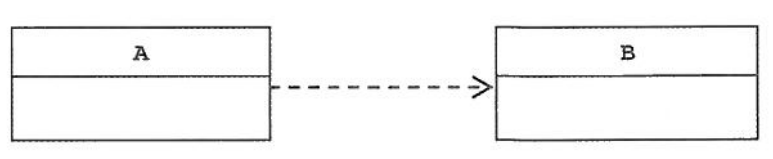

스프링 기초를 공부하거나, 핵심 개념을 공부한다면 `DI/IoC` 는 빼놓을 수 없는 중요한 개념입니다. 객체지향 설계 원칙을 더욱 우아하게 지킬 수 있도록 도와주는 스프링의 3대 요소 중 하나인 `DI/IoC` 의 개념을 예제 코드와 함께 정리해보도록 하겠습니다.

## DI (의존관계 주입)

### 의존관계

먼저 의존관계란 무엇인지 생각해봅시다.

두 개의 클래스 또는 모듈이 의존관계에 있다고 말할 때는 누가 누구에게 의존하는 관계에 있다는 식이여야 합니다. UML 모델에서는 두 클래스의 의존관계를 다음과 같이 점선으로 된 화살표로 표현합니다.



> A가 B에 의존하고 있음을 나타낸다.

그렇다면 의존하고 있다는 건 무슨 의미일까? 의존한다는 건 의존대상, 여기서는 B가 변하면 그것이 A에 영향을 미친다는 뜻입니다. B의 기능이 추가되거나 변경된다면 그 영향이 A로 전달된다는 뜻입니다. 만약에 B의 형식은 그대로지만 기능이 내부적으로 변경되면, 결과적으로 A의 기능이 수행되는 데도 영향을 미칠 수 있습니다. 의존관계에는 방향성이 있습니다. A가 B에 의존하고 있지만, 반대로 B는 A에 의존하지 않습니다.

### 의존관계 주입 전

```
public class UserDao {
  DConnectionMaker connectionMaker = new DConnectionMaker();
}
```

이 코드에 따르면 UserDao는 이미 설계 시점에서 DConnectionMaker의 클래스의 존재를 알고 있습니다. 따라서 런타임 의존관계, 즉 DConnectionMaker 오브젝트를 사용하겠다는 것까지 UserDao가 결정하고 관리하는 셈입니다. 그래서 `IoC` 방식을 사용해서 UserDao로부터 런타임 의존관계를 드러내는 코드를 제거하고, 제3의 존재에 런타임 의존관계 결정 권한을 위임합니다.

### 의존관계 주입 후

```
public class UserDao {

  private DConnectionMaker dConnectionMaker;

  public UserDao(DConnectionMaker dConnectionMaker) {
    this.dConnectionMaker = dConnectionMaker;
  }
}
```

DI 컨테이너는 UserDao를 만드는 시점에 생성자의 파라미터로 이미 만들어진 DConnectionMaker의 오브젝트를 전달합니다. 이렇게 해서 두 개의 오브젝트 간에 런타임 의존관계가 만들어졌습니다. UserDao 오브젝트는 이제 생성자를 통해 주입받은 DConnectionMaker 오브젝트를 언제든지 사용하면 됩니다.

이렇게 DI 컨테이너에 의해 런타임시 의존 오브젝트를 사용할 수 있도록 그 레퍼런스를 전달받는 과정이 마치 생성자를 통해 DI 컨테이너가 UserDao에게 주입해주는 것과 같다고 해서 이를 의존관계 주입이라고 합니다.

`DI`는 자신이 사용할 오브젝트에 대한 선택과 생성 제어권을 외부로 넘기고 자신은 수동적으로 주입받은 오브젝트를 사용한다는 점에서 `IoC` 의 개념에 잘 들어맞습니다. 스프링 컨테이너의 `IoC` 는 주로 의존관계 주입이라는데 초점이 맞춰져 있습니다. 그래서 스프링을 IoC 컨테이너 외에도 DI 컨테이너 또는 DI 프레임 워크라고 부르는 것 입니다.

## IoC(inversion of Control)

기존 프로그램은 클라이언트 구현 객체가 스스로 필요한 서버 구현 객체를 생성하고, 연결했습니다. 한마디로 구현 객체가 프로그램의 제어 흐름을 스스로 조종했습니다. 반면에 스프링 컨테이너를 사용하면 프로그램에 대한 제어 흐름에 대한 권한은 모두 스프링 컨테이너가 가지고 있습니다. 이렇듯 프로그램의 제어 흐름을 직접 제어하는 것이 아니라 외부에서 관리하는 것을 `제어의 역전(IoC)` 이라고 부릅니다. 즉, 객체를 제어하고 관리하는 역할이 개발자로부터 스프링 컨테이너에 `역전` 된다는 뜻입니다.

스프링에서는 스프링이 제어권으로 직접 만들고 관계를 부여하는 오브젝트를 `bean` 이라고 부르고, `bean` 의 생성과 관계 설정 같은 제어를 담당하는 IoC 오브젝트를 `bean factory` 라고 부릅니다.

### IoC(inversion of Control) 적용 전

```
public class UserDao {

  private DConnectionMaker dConnectionMaker;

  public UserDao(DConnectionMaker dConnectionMaker) {
    this.dConnectionMaker = dConnectionMaker;
  }
}
```

### IoC(inversion of Control) 적용 후

```
public class UserDao {

  private DConnectionMaker dConnectionMaker;

  public UserDao(DConnectionMaker dConnectionMaker) {
    this.dConnectionMaker = dConnectionMaker;
  }
}

@Configuration
public class DaoConfig {

  @Bean
  public DConnectionMaker dConnectionMaker() {
    return new DConnectionMaker();
  }

  @Bean
  public UserDao userDao() {
    return new UserDao(dConnectionMaker());
  }
}
```

`@Configuration` 이 붙은 DaoConfig 는 이 `ApplicationContext` 가 활용하는 IoC 설정 정보 입니다. `ApplicationContext` 는 DaoConfig 클래스를 설정정보로 등록해두고 `@Bean` 이 붙은 메소드의 이름을 가져와 빈 목록을 만들어둡니다.

### 스프링 컨테이너

`ApplicationContext` 를 스프링 컨테이너라고 부릅니다. 기존에는 개발자가 직접 객체를 생성하고 DI 했지만, 이제부터는 스프링 컨테이너를 통해서 사용합니다. 스프링 컨테이너는 `@Configuration` 이 붙은 클래스를 설정 정보로 사용합니다. 여기서 `@Bean` 이라 적힌 메서드를 모두 호출해서 반환된 객체를 스프링 컨테이너에 등록합니다. 이렇게 스프링 컨테이너에 등록된 객체를 스프링 빈이라고 부릅니다. 기존에는 개발자가 직접 자바 코드로 모든 것을 했다면 스프링 컨테이너에 객체를 스프링 빈으로 등록하고, 스프링 컨테이너에서 스프링 빈을 찾아서 사용할 수 있습니다.

#### 스프링 컨테이너의 장점

스프링 컨테이너는 싱글톤 패턴을 적용하지 않아도, 객체 인스턴스를 싱글톤으로 관리합니다. 이렇게 싱글톤 객체를 생성하고 관리하는 기능을 `싱글톤 레지스트리` 라고 합니다. 스프링 컨테이너의 이런 기능 덕분에 싱글톤 패턴의 모든 단점을 해결하면서 객체를 싱글톤으로 유지할 수 있습니다.

## 결론

스프링이란 결국 `어떻게 오브젝트가 설계되고, 만들어지고, 어떻게 관계를 맺고 사용되는지에 관심을 두는 프레임워크` 라는 사실을 꼭 기억해두어야 합니다. 어떤 의존관계를 가질지 결정하는 일은 스프링이 아니라 개발자의 역할이며 책임입니다. 스프링은 단지 원칙을 잘 따르는 설계를 적용하려고 할 때 필연적으로 등장하는 번거로운 작업을 편하게 할 수 있도록 도와주는 도구일 뿐임을 잊으면 안 됩니다.