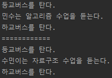

# 템플릿_메소드_패턴 예제

`변하는 것과 변하지 않는 것을 분리`

`Template Method Pattern` 은 이런 문제들을 해결하는 디자인 패턴이다.

```
@Slf4j
public class TemplateMethodTest {

  @Test
  void templateMethodV0() {
    logic1();
    logic2();
  }

  private void logic1() {
    long startTime = System.currentTimeMillis();
    // 비즈니스 로직 실행
    log.info("비즈니스 로직1 실행");
    // 비즈니스 로직 종료
    long endTime = System.currentTimeMillis();
    long resultTime = endTime - startTime;
    log.info("resultTime={}", resultTime);
  }

  private void logic2() {
    long startTime = System.currentTimeMillis();
    // 비즈니스 로직 실행
    log.info("비즈니스 로직2 실행");
    // 비즈니스 로직 종료
    long endTime = System.currentTimeMillis();
    long resultTime = endTime - startTime;
    log.info("resultTime={}", resultTime);
  }
}
```

`핵심 기능` 은 해당 객체가 제공하는 고유의 기능이다. 예를 들어서 `logic1` 의 핵심 기능은 비즈니스 로직이다.

`부가 기능` 은 핵심 기능을 보조하기 위해 제공되는 기능이다. 예를 들어서 로그 추적 로직, 트랜잭션 기능이 있다. 이러한 부가 기능은 단독으로 사용되지는 않고, 핵심 기능과 함께 사용된다. 예를 들어서 시간 측정
기능은 메소드마다 수행 시간의 로그를 남기기 위해 사용한다. 그러니까 핵심 기능을 보조하기 위해 존재한다.


- 변하는 부분: 비즈니스 로직
- 변하지 않는 부분 : 시간 측정

***만약 클래스가 수백개라면???***

이제 `템플릿 메소드 패턴` 을 사용해서 변하는 부분과 변하지 않는 부분을 분리해보자.

`템플릿 메소드 패턴 구조 그림`

