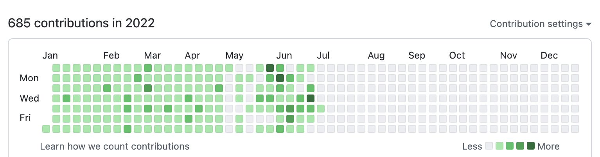

# 2022년 상반기 회고

## 회고를 시작하며

올해를 맞이하며 처음으로 정했던 첫 목표는 `회고 작성하기` 였다. 자신을 아무리 잘 알고 있다고 해도 스스로 칭찬과 피드백을 글로 남긴다면 지속적인 성장에 도움을 줄 수 있으리라 생각했다.
2022년 상반기는 `선택과 집중` 이 필요한 시기였고 나에게 많은 변화가 있던 시간이었다.

## 시나브로

`모르는 사이에 조금씩 조금씩` 라는 의미를 가진 순우리말이다. 나는 올해의 키워드를 `시나브로` 로 정했다.
출퇴근 시간, 평일 저녁, 주말에 꾸준히 공부하는 습관을 길들였다. 이렇게 꾸준히 공부하는 습관은 시나브로 어느샌가 머릿속에 지식으로 축적되리라 생각했고 매일 공부하기 위해 노력하였다.
`1일 1커밋` 문화는 지속해서 공부하는 습관을 길들이기에 효과적이라고 생각한다. 시각적으로 재미도 있고, 공부한 내용을 `public` 공간에 정리하면서 내가 어떤 공부를 하는지 다른 개발자들과 소통하게 되는 장점도 있다.
단점을 굳이 꼽자면 잔디를 채우기 위해 의미 없는 커밋을 채운 적도 있었다. 하지만 괜찮다고 생각한다. 어떤 커밋을 남기던 공부를 하기 위해 귀찮은 몸을 이끌고 코드를 작성했다는 의미니까.

## 홀로서기

기존 회사에서 팀장님의 갑작스러운 퇴사로 인해 약 6개월 동안 리더의 역할을 맡았다. 업무 분배와 팀 운영까지 혼자 담당했고, 신입 두 분을 이끌고 끌고 가는 일은 생각보다 쉽지 않았다.
퇴사로 인해 분위기가 팀이 흔들리지 않도록 `나도 팀장님만큼 할 수 있어` 라는 모습을 팀원들에게 많이 보여주려고 노력하였다. 늦은 저녁까지 팀원들의 모든 커밋을 확인하고 코드 리뷰를 해드렸고, 팀원의 성장에 도움이 될 수 있는 업무를 할당해드렸다.
작은 회사이지만 나름 `자체 서비스` 를 하는 기업이므로 구색을 갖추기 위해 많이 노력하였다. 모니터링 도구, CI/CD, 문서화 등 그동안 사내에서 부족했던 부분을 `회사의 성장이 곧 나의 성장` 이라는 생각으로 기여하였다.
결과적으로 회사에서 성과를 인정해주었고, 파격적이진 않았지만 `사내 연봉 인상률 1등` 이라는 쾌거를 이루었다.

## 퇴사를 결심하다

결론부터 말하자면 올해 퇴사는 할 예정이었다. 회사에 대한 불만보다는 더 이상 성장 동력이 없었다. 주니어 시절에 더 많은 경험과 성장이 하고 싶었다.
지속해서 다른 개발자들과 공부를 하면서 실력을 향상해왔지만 결국 실무에서의 경험과는 절대 비교할 수 없다고 생각했기에 단 한 번의 고민도 없이 이직 준비를 시작하였다.

## 이직

이직 목표는 `무조건 서비스 기업` 이었다. 내가 직접 서비스를 누군가 사용한다는 건 늘 설렌다. 기업 규모보다는 좋은 개발 문화와 맥북을 지급하는 회사를 목표로 정했다. 큰 의미는 없지만, 맥북이 가지고 싶었고 개발자들에게 맥북을 지급하는 회사는 개발자를 대우해준다는 느낌이 들어 기준에 넣었다. 준비 기간은 5월까지 무조건 이직을 목표로 준비하였다. 5시에 퇴근해서 10시까지는 무조건 회사에 남아서 공부했다. `선택과 집중` 이 필요한 시점에 코딩 테스트는 과감히 포기하였다.
시간이 지날수록 경력이 쌓이는 부담감에 `쓸데없는 경력` 이 되지 않기 위해선 빠른 이직이 필요하다고 느꼈다.
하지만 코딩 테스트를 포기한 만큼 지원할 수 있는 회사의 폭은 절반 이상으로 줄어들었다.

여러 회사가 있었지만 많은 고민 끝에 `줌인터넷` 에 합류하게 되었다.
우선 `기술 블로그` 를 운영한다는 점에서 좋은 개발 문화를 가지고 있다고 생각했고,
어느 정도 규모도 있기에 개발에 집중할 수 있다는 점도 매력적으로 다가왔다.

이직에 대한 자세한 이야기는 따로 작성하도록 하겠다.

## 대외활동

2022년 상반기에는 미친 듯이 대외활동을 했다. 안목을 키우고 싶었고 우물 안 개구리가 되기 싫었다.

### 디프만

`디프만` 이라는 동아리에 선발되어 4개월 동안 프로젝트에 참여하였다. 기획부터 운영까지 모든 단계에 참여하면서 폭발적인 성장을 할 수 있었다.
업무 능력에 직접적으로 도움이 되는 `하드 스킬` 에도 도움이 되었지만, 짧은 기간 동안 출시를 목표로 하는 만큼 `소프트 스킬` 을 키우는 데 많은 도움이 되었다.
`디프만` 동아리에서 정말 많은 사람을 만났고 좋은 얘기를 많이 나누었다. 개발을 사랑하는 사람들이라면 지원하는 것을 강력히 추천한다.

### 우아한 유스방 3기

카카오톡 오픈채팅 `유쾌한 스프링 방` 에서 `우아한형제들` 에 재직 중인 `제이슨` 님이 진행하는 스터디이다. 운 좋게 선발되어 합류하게 되었다.
스터디 과정을 전부 공개하지는 못하지만, 이력서를 작성하는 방법부터 모의 면접까지 이직을 준비하는 과정에서 많은 도움을 받았다.
특히 매일 저녁 10시 `SLiPP` 게더타운에서 데일리 스크럼을 하며 서로의 생각을 공유하는 문화는 공부가 끝나도 계속 하고 싶을 정도로 좋았다.

## 회고를 마치며

처음으로 작성하는 회고록이라 내 감정을 100% 글로 표현하지 못했지만, 상반기를 되돌아볼 수 있는 계기가 되어 좋다. 최근 김창준 님의 `함께 자라기` 라는 책을 출퇴근 길에 읽고 있다.
학습 방법부터 성장 방향성까지 좋은 개발자로 성장하기 위한 내용들이 가득하다. 2022년 상반기에는 이직을 위한 학습을 했다면,
2022년 하반기에는 부족한 전공 지식이나, 박재성 님이 운영하시는 `NEXTSTEP` 공부, `코프링` 등 내가 하고 싶은 공부하려고 한다.

누군가가 나를 소개했을 때 `같은 팀에서 일하고 싶은 사람` 이 되기 위해
